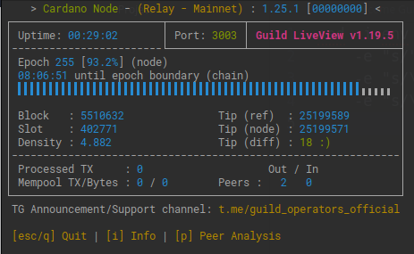
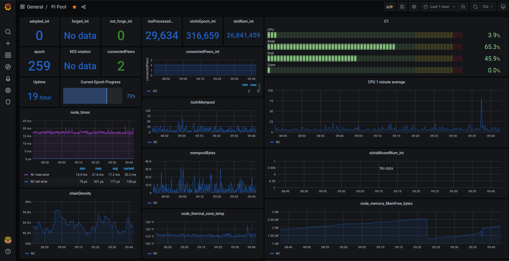

# Environment Setup

## Install packages

Enable automatic updates.

```bash
sudo apt update && sudo apt install unattended-upgrades
sudo dpkg-reconfigure -plow unattended-upgrades
```

Install necessities.

```bash
sudo apt install build-essential libssl-dev tcptraceroute python3-pip \
         jq make automake unzip net-tools nginx pkg-config \
         libffi-dev libgmp-dev libssl-dev libtinfo-dev libsystemd-dev \
         zlib1g-dev make g++ libncursesw5 libtool autoconf -y
```

Install nodejs & cardanoclijs



```bash
sudo snap install node --classic
```

```bash
npm install cardanocli-js
```

Install Certbot.



```bash
sudo snap install --classic certbot
```

Dynamically link binary into our path.

```bash
sudo ln -s /snap/bin/certbot /usr/bin/certbot
```

Install node process manager globally.

```bash
 sudo npm install pm2 -g
```

House cleaning. 🧹 

```bash
sudo apt clean
sudo apt autoremove
sudo apt autoclean
```

## Environment

Make some directories.

```bash
mkdir -p $HOME/.local/bin
mkdir -p $HOME/pi-pool/files
mkdir -p $HOME/pi-pool/scripts
mkdir -p $HOME/pi-pool/logs
mkdir $HOME/git
mkdir $HOME/tmp
```

### Create bash variables & add ~/.local/bin to our $PATH 🏃♀ 


[Environment Variables in Linux/Unix](https://askubuntu.com/questions/247738/why-is-etc-profile-not-invoked-for-non-login-shells/247769#247769).


```bash
echo PATH="$HOME/.local/bin:$PATH" >> $HOME/.bashrc
echo export NODE_HOME=$HOME/pi_pool >> $HOME/.bashrc
echo export NODE_FILES=$HOME/pi_pool/files >> $HOME/.bashrc
echo export NODE_CONFIG=mainnet>> $HOME/.bashrc
echo export NODE_BUILD_NUM=$(curl https://hydra.iohk.io/job/Cardano/iohk-nix/cardano-deployment/latest-finished/download/1/index.html | grep -e "build" | sed 's/.*build\/\([0-9]*\)\/download.*/\1/g') >> $HOME/.bashrc
echo export CARDANO_NODE_SOCKET_PATH="$NODE_HOME/db/socket" >> $HOME/.bashrc
source $HOME/.bashrc
```

### Retrieve aarch64 binaries


The **unofficial** cardano-node & cardano-cli binaries available to us are being built by an IOHK engineer in his **spare time**. Please visit the '[Arming Cardano](https://t.me/joinchat/FeKTCBu-pn5OUZUz4joF2w)' Telegram group for more information.


```bash
cd $HOME/tmp
wget -O cardano_node_$(date +"%m-%d-%y").zip https://ci.zw3rk.com/job/Tools/master/aarch64-unknown-linux-musl-cardano-node-musl.tarball/latest-finished/download
unzip *.zip
mv cardano-node/* $HOME/.local/bin
rm -r cardano-node
cd $HOME
```


If binaries already exist you will have to confirm overwriting the old ones.


Confirm binaries are in ada $PATH.

```bash
cardano-node version
cardano-cli version
```

### Systemd unit files

Let us now create the systemd unit file and startup script so systemd can manage cardano-node.

```bash
nano $HOME/.local/bin/cardano-service
```

Paste the following, save & exit.

```bash
#!/bin/bash
DIRECTORY=/home/ada/pi-pool
FILES=/home/ada/pi-pool/files
PORT=3003
HOSTADDR=0.0.0.0
TOPOLOGY=${FILES}/mainnet-topology.json
DB_PATH=${DIRECTORY}/db
SOCKET_PATH=${DIRECTORY}/db/socket
CONFIG=${FILES}/mainnet-config.json
## +RTS -N4 -RTS = Multicore(4)
cardano-node run +RTS -N4 -RTS \
  --topology ${TOPOLOGY} \
  --database-path ${DB_PATH} \
  --socket-path ${SOCKET_PATH} \
  --host-addr ${HOSTADDR} \
  --port ${PORT} \
  --config ${CONFIG}
```

Allow execution of our new startup script.

```bash
sudo chmod +x $HOME/.local/bin/cardano-service
```

Open /etc/systemd/system/cardano-node.service

```bash
sudo nano /etc/systemd/system/cardano-node.service 
```

Paste the following, save & exit.

```bash
# The Cardano Node Service (part of systemd)
# file: /etc/systemd/system/cardano-node.service 

[Unit]
Description     = Cardano node service
Wants           = network-online.target
After           = network-online.target

[Service]
User            = ada
Type            = simple
WorkingDirectory= /home/ada/pi-pool
ExecStart       = /bin/bash -c "PATH=/home/ada/.local/bin:$PATH exec /home/ada/.local/bin/cardano-service"
KillSignal=SIGINT
RestartKillSignal=SIGINT
TimeoutStopSec=3
LimitNOFILE=32768
Restart=always
RestartSec=5

[Install]
WantedBy= multi-user.target
```

Set permissions and reload systemd so it picks up our new service file..

```bash
sudo systemctl daemon-reload
```

Let's add a function to the bottom of our .bashrc file to make life a little easier.

```bash
nano $HOME/.bashrc
```

```bash
cardano-service() {
    #do things with parameters like $1 such as
    sudo systemctl "$1" cardano-node.service
}
```

Save & exit.

```bash
source $HOME/.bashrc
```

What we just did there was add a function to control our cardano-service without having to type out 

> > sudo systemctl enable cardano-node.service 
> >
> > sudo systemctl start cardano-node.service 
> >
> > sudo systemctl stop cardano-node.service 
> >
> > sudo systemctl status cardano-node.service

Now we just have to:

* cardano-service enable  \(enables cardano-node.service auto start at boot\)
* cardano-service start      \(starts cardano-node.service\)
* cardano-service stop       \(stops cardano-node.service\)
* cardano-service status    \(shows the status of cardano-node.service\)

### gLiveView.sh

Guild operators scripts has a couple useful tools for operating a pool. We do not want the project as a whole, though there are a couple scripts we are going to use.



```bash
cd $NODE_HOME/scripts
wget https://raw.githubusercontent.com/cardano-community/guild-operators/master/scripts/cnode-helper-scripts/env
wget https://raw.githubusercontent.com/cardano-community/guild-operators/master/scripts/cnode-helper-scripts/gLiveView.sh
```

We have to edit the env file to work with our environment. The port number here will have to be updated to match the port cardano-node is running on. For the **Pi-Node** it's port 3003. As we build the pool we will work down. For example Pi-Relay\(2\) will run on port 3002, Pi-Relay\(1\) on 3001 and Pi-Core on port 3000.


You can change the port cardano-node runs on in /home/ada/.local/bin/cardano-service.


```bash
sed -i env \
    -e "s/"6000"/"3003"/g" \
    -e "s/\#CONFIG=\"\${CNODE_HOME}\/files\/config.json\"/CONFIG=\"\${NODE_FILES}\/mainnet-config.json\"/g" \
    -e "s/\#SOCKET=\"\${CNODE_HOME}\/sockets\/node0.socket\"/SOCKET=\"\${NODE_HOME}\/db\/socket\"/g"
    
```

Allow execution of gLiveView.sh.

```bash
chmod +x gLiveView.sh
```

We will have a look at gLiveView.sh once we are ready to start cardano-node. But first some more configuring..

## topologyUpdater.sh

Until peer to peer is enabled on the network operators need a way to get a list of relays/peers to connect to. The topology updater service runs in the background with cron. Every hour the script will run and tell the service you are a relay and want to be a part of the network. It will add your relay to it's directory after four hours and start generating a list of relays in a json file in the $NODE\_HOME/logs directory. A second script, relay-topology\_pull.sh can then be used manually to generate a mainnet-topolgy file with relays/peers that are aware of you and you of them.


The list generated will show you the distance in miles & a clue as to where the relay is located.


Open a file named topologyUpdater.sh

```bash
cd $NODE_HOME/scripts
nano topologyUpdater.sh
```

Paste in the following, save & exit.


The port number here must match the port cardano-node is running on. If you are using dns records you can add the FQDN that matches on line 6\(line 6 only\). Leave it as is if you are not using dns. The service will pick up the public IP and use that.


```bash
#!/bin/bash
# shellcheck disable=SC2086,SC2034
 
USERNAME=ada
CNODE_PORT=3003 # must match your relay node port as set in the startup command
CNODE_HOSTNAME="CHANGE ME"  # optional. must resolve to the IP you are requesting from
CNODE_BIN="/home/ada/.local/bin"
CNODE_HOME=/home/ada/pi-pool
CNODE_LOG_DIR="${CNODE_HOME}/logs"
GENESIS_JSON="${CNODE_HOME}/files/mainnet-shelley-genesis.json"
NETWORKID=$(jq -r .networkId $GENESIS_JSON)
CNODE_VALENCY=1   # optional for multi-IP hostnames
NWMAGIC=$(jq -r .networkMagic < $GENESIS_JSON)
[[ "${NETWORKID}" = "Mainnet" ]] && HASH_IDENTIFIER="--mainnet" || HASH_IDENTIFIER="--testnet-magic ${NWMAGIC}"
[[ "${NWMAGIC}" = "1097911063" ]] && NETWORK_IDENTIFIER="--mainnet" || NETWORK_IDENTIFIER="--testnet-magic ${NWMAGIC}"
 
export PATH="${CNODE_BIN}:${PATH}"
export CARDANO_NODE_SOCKET_PATH="${CNODE_HOME}/db/socket"
 
blockNo=$(/home/ada/.local/bin/cardano-cli query tip ${NETWORK_IDENTIFIER} | jq -r .block )
 
# Note:
# if you run your node in IPv4/IPv6 dual stack network configuration and want announced the
# IPv4 address only please add the -4 parameter to the curl command below  (curl -4 -s ...)
if [ "${CNODE_HOSTNAME}" != "CHANGE ME" ]; then
  T_HOSTNAME="&hostname=${CNODE_HOSTNAME}"
else
  T_HOSTNAME=''
fi

if [ ! -d ${CNODE_LOG_DIR} ]; then
  mkdir -p ${CNODE_LOG_DIR};
fi
 
curl -s -4 "https://api.clio.one/htopology/v1/?port=${CNODE_PORT}&blockNo=${blockNo}&valency=${CNODE_VALENCY}&magic=${NWMAGIC}${T_HOSTN>
```

Save, exit and make it executable.

```bash
chmod +x topologyUpdater.sh
```

Now you can run the script once to ensure it is working. 

```bash
./topologyUpdater.sh
```

Successful execution will result in a message similar to.. 

> `{ "resultcode": "201", "datetime":"2021-03-29 01:23:45", "clientIp": "1.2.3.4", "iptype": 4, "msg": "nice to meet you" }`

Now that it's working we can create a cron job that will run the script every hour.

```bash
crontab -e
```

Add the following to the bottom, save & exit.

```bash
33 * * * * /home/ada/pi-pool/scripts/topologyUpdater.sh
```

After 4 hours of on boarding you will be added to the service and can pull your new list of peers into the mainnet-topology file.

Create another file relay-topology\_pull.sh and paste in the following.

```bash
nano relay-topology_pull.sh
```

```bash
#!/bin/bash
BLOCKPRODUCING_IP=<BLOCK PRODUCERS PRIVATE IP>
BLOCKPRODUCING_PORT=3000
curl -4 -s -o /home/ada/pi-pool/files/${NODE_CONFIG}-topology.json "https://api.clio.one/htopology/v1/fetch/?max=15&customPeers=${BLOCKPRODUCING_IP}:${BLOCKPRODUCING_PORT}:1|relays-new.cardano-mainnet.iohk.io:3001:2"
```

Save, exit and make it executable.

```bash
chmod +x relay-topology_pull.sh
```


Pulling in a new list will overwrite your existing topology file. Keep that in mind.


After 4 hours you can pull in your new list and restart the cardano-service.

```bash
cd $NODE_HOME/scripts
./relay-topology_pull.sh
```


relay-topology\_pull.sh will add 15 peers to your mainnet-topology file. I usually remove the furthest 5 relays and use the closest 10. 


```bash
nano $NODE_FILES/${NODE_CONFIG}-topology.json
```


You can use gLiveView.sh to view ping times in relation to the peers in your mainnet-topology file. Use Ping to resolve hostnames to IP's.


Changes to this file will take affect upon restarting the cardano-service.


Don't forget to remove the last comma in your topology file!


Status should show as enabled & running.

Once your node syncs past epoch 208\(shelley era\) you can use gLiveView.sh to monitor.

```bash
cd $NODE_HOME/scripts
./gLiveView.sh
```




## Prometheus, Node Exporter & Grafana

Prometheus connects to cardano-nodes backend and serves metrics over http. Grafana in turn can use that data to display graphs and create alerts. Our Grafana dashboard will be made up of data from our Ubuntu system & cardano-node. Grafana can display data from other sources as well, like [adapools.org](https://adapools.org/).


You can connect a Telegram bot to Grafana which can alert you of problems with the server. Much easier than trying to configure email alerts.






### Install Prometheus & Node Exporter.


Prometheus can scrape the http endpoints of other servers running node exporter. Meaning Grafana and Prometheus does not have to be installed on your core and relays. Only the package prometheus-node-exporter is required if you would like to build a central Grafana dashboard for the pool, freeing up resources.


```bash
sudo apt-get install -y prometheus prometheus-node-exporter 
```

### Configure Prometheus

Open prometheus.yml.

```bash
sudo nano /etc/prometheus/prometheus.yml
```

Replace the contents of the file with.


Indentation must be correct YAML format or Prometheus will fail to start.


```yaml
global:
  scrape_interval:     5s # By default, scrape targets every 15 seconds.

  # Attach these labels to any time series or alerts when communicating with
  # external systems (federation, remote storage, Alertmanager).
  external_labels:
    monitor: 'codelab-monitor'

# A scrape configuration containing exactly one endpoint to scrape:
# Here it's Prometheus itself.
scrape_configs:
  # The job name is added as a label job=<job_name> to any timeseries scraped from this config.
  - job_name: 'cardano-node'

    static_configs:
      - targets: ['localhost:12798']
        labels:
          alias: 'N1'
          type:  'cardano-node'

      - targets: ['localhost:9100']
        labels:
          alias: 'N1'
          type: 'node'
```

Save & exit.

Edit mainnet-config.json so cardano-node exports traces on all interfaces.

```bash
cd $NODE_FILES
sed -i ${NODE_CONFIG}-config.json -e "s/127.0.0.1/0.0.0.0/g"  
```

### Install Grafana



Add Grafana's gpg key to Ubuntu.

```bash
wget -q -O - https://packages.grafana.com/gpg.key | sudo apt-key add -
```

Add latest stable repo to apt sources.

```bash
echo "deb https://packages.grafana.com/oss/deb stable main" | sudo tee -a /etc/apt/sources.list.d/grafana.list
```

Update your package lists & install Grafana.

```bash
sudo apt update
sudo apt install grafana
```

Change the port Grafana listens on so it does not clash with cardano-node.

```bash
sudo sed -i /etc/grafana/grafana.ini \
-e "s/;http_port/http_port/" \
-e "s/3000/5000/"
```

### cardano-monitor bash function

Open .bashrc.

```bash
cd $HOME
nano .bashrc
```

Down at the bottom add.

```bash
cardano-monitor() {
    #do things with parameters like $1 such as
    sudo systemctl "$1" prometheus.service
    sudo systemctl "$1" prometheus-node-exporter.service
    sudo systemctl "$1" grafana-server.service
}
```

Save, exit & source.

```bash
source .bashrc
```

Here we tied all three services under one function. Enable Prometheus.service, prometheus-node-exporter.service & grafana-server.service to run on boot and start the services.

```bash
cardano-monitor enable
cardano-monitor start
```


At this point you may want to start cardano-service and get synced up before we continue to configure Grafana. Skip ahead to [syncing the chain section](https://app.gitbook.com/@wcatz/s/pi-pool-guide/~/drafts/-MYFtFDZp-rTlybgAO71/pi-node/environment-setup/@drafts#syncing-the-chain). Choose whether you want to wait 30 hours or download my latest chain snapshot. Return here once gLiveView.sh shows you are at the tip of the chain.


### Configure Grafana

On your local machine open your browser and got to http://&lt;Pi-Node's private ip&gt;:5000

Log in and set a new password. Default username and password is admin:admin.

## Congratulations you are now ready to start cardano-node 🥳 

### ⛓ Syncing the chain ⛓ 

You are now ready to start cardano-node. Doing so will start the process of 'syncing the chain'. This is going to take about 30 hours and the db folder is about 8.5GB in size right now. We used to have to sync it to one node and copy it from that node to our new ones to save time.

## Download snapshot


Do not attempt this on an 8GB sd card. Not enough space! [Create your image file](https://app.gitbook.com/@wcatz/s/pi-pool-guide/create-.img-file) and flash it to your ssd.


I have started taking snapshots of my backup nodes db folder and hosting it in a web directory. With this service it takes around 15 minutes to pull the latest snapshot and maybe another 30 minutes to sync up to the tip of the chain. This service is provided as is. It is up to you. If you wan't to sync the chain on your own simply:

```bash
cardano-service enable
cardano-service start
cardano-service status
```

Make sure your node is **not** running & delete the db folder if it exists.

```bash
cardano-service stop
cd $NODE_HOME
rm -r db/
wget -r -np -nH -R "index.html*" -e robots=off https://db.adamantium.online/db/
```

Once wget completes enable & start cardano-node.

```bash
cardano-service enable
cardano-service start
cardano-service status
```


[Head back up to configure Grafana to use Prometheus as a data source and add a dashboard](https://app.gitbook.com/@wcatz/s/pi-pool-guide/~/drafts/-MYGHLg0mcZMnrtSpB06/pi-node/environment-setup#configure-grafana).



